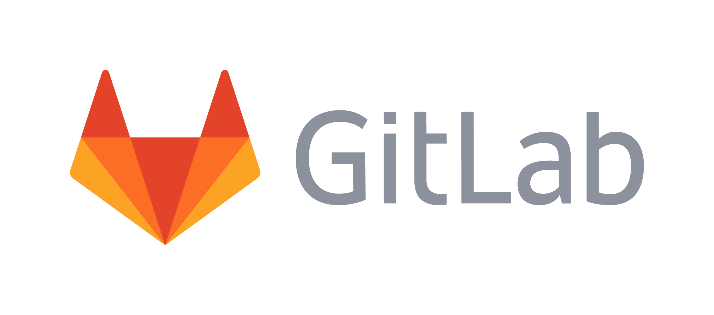

```{r, include = F}
knitr::opts_chunk$set(fig.width = 6, message = FALSE, warning = FALSE, comment = "", cache = FALSE, fig.retina = 3)
library(flipbookr)
library(tidyverse)
library(flair)
library(kableExtra)
library(fontawesome)
```
```{r xaringan-themer, include=FALSE, warning=FALSE}
library(xaringanthemer)
style_duo_accent(
  #base_color = "#43a2ca",
  header_font_google = google_font("Mukta"),#Ubuntu Condensed
  text_font_google   = google_font("Montserrat", "300", "300i"),
  code_font_google   = google_font("Fira Mono"),
  primary_color      = "#0F4C81", # pantone classic blue
  secondary_color    = "#b3e2cd", # pantone baby blue
  #header_font_google = google_font("Raleway"),
  #text_font_google   = google_font("Raleway", "300", "300i"),
  #code_font_google   = google_font("Source Code Pro"),
  text_font_size     = "25px"
#   colors = c(
#   red = "#f34213",
#   purple = "#3e2f5b",
#   orange = "#ff8811",
#   green = "#136f63",
#   white = "#FFFFFF",
# )
)

```

```{r, include=FALSE}
text_spec2 <- function(x = "x"){
  text_spec(x, background = "#b3e2cd", bold = T)
}

text_R <- function(x = "x"){
  text_spec(x, background = "#810f7c", bold = T)
}

text_D <- function(x = "x"){
  text_spec(x, background = "#b30000", bold = T)
}

text_A <- function(x = "x"){
  text_spec(x, background = "#99d8c9", bold = T)
}

text_U <- function(x = "x"){
  text_spec(x, background = "#fec44f", bold = T)
}

text_M <- function(x = "x"){
  text_spec(x, background = "#3182bd", bold = T)
}

```
```{r xaringanExtra, echo=FALSE}
#xaringanExtra::use_xaringan_extra(c("tile_view", "animate_css", "tachyons"))
#xaringanExtra::use_freezeframe()
xaringanExtra::use_clipboard()
#xaringanExtra::use_editable(expires = 1)
```
# ¿Qué haremos hoy?

- Características y  `r text_spec2("objetivos")` del curso

- Repaso de conceptos de  `r text_spec2("R Base")` 

- Trabajo en proyecto (`r text_spec2(".RProj")`)

- ¿Qué es  `r text_spec2("git")`? ¿Qué es  `r text_spec2("GitLab")`?

- Crear una cuenta de GitLab

- Configuración de git en RStudio


---
class: hide-logo
# Características del curso

```{r setup, include=FALSE}
options(htmltools.dir.version = FALSE)
knitr::opts_chunk$set(warning = FALSE, message = FALSE)
```

.left-column[
<br>

`r fa(name = "laptop", fill = "#756bb1", height =  "2em", width = "2em")`
<br><br>

`r fa("link", fill = "#756bb1", height =  "2em", width = "2em")`
<br><br>

`r fa("question", fill = "#756bb1", height =  "2em", width = "2em")`
<br><br>

`r fa("file", fill = "#756bb1", height =  "2em", width = "2em")`
<br><br>

`r fa("comments", fill = "#756bb1", height =  "2em", width = "2em")`

]

.right-column[

Espacio "presencial": `r text_spec2("20 horas")` de clases teóricas/prácticas
<br><br>

[Webasignatura](https://webasignatura.ucu.edu.uy/course/view.php?id=6789) 
<br><br>

Participar durante la clase a través del `r text_spec2("chat")` de zoom o `r text_spec2("pedir la palabra")`.
<br><br>

`r text_spec2("Examen")` opcional
<br><br>

`r text_spec2("Dedicación:")` durante el curso y después ... es la .red[clave]
]

---
# Objetivos

.left-column[
<br><br><br>


]

.right-column[

- Profundizar en la `r text_spec2("programación")` en R para `r text_spec2("ciencia de datos")`.
<br>

- Aprender `r text_spec2("buenas prácticas")` de escribir código (R/RStudio), `r text_spec2("trabajo colaborativo")` y `r text_spec2("reproducibilidad")` del código.
<br>

- Aprender a escribir `r text_spec2("funciones propias")`, testearlas y documentarlas.
<br>

- Aprender a usar el `r text_spec2("control de versiones")` (Git/GitLab). 
<br>

- Desarrollar un paquete de R combinando todo lo anterior.
<br>

- Usaremos `r text_spec2("varios conjuntos de datos")` para abordar diferentes problemas.
]


---
# Ciencia de datos

.left-column[
<br><br><br>


]

.right-column[

- Disciplina que combina `r text_spec2("matemática")`, `r text_spec2("programación")`, `r text_spec2("estadística")`, entre otras, para trabajar con grandes vólumenes de `r text_spec2("datos")`.  

- Implica el procesamiento, limpieza, análisis de datos y la publicación de resultados.

- Al final del curso habrás aprendido a usar un gran conjunto de herramientas para limpiar y transformar tus datos así como hacer tus propios desarrollos en R.

- R provee el paquete Tidyverse que es una colección de paquetes que abarcan todo el flujo de trabajo de la ciencia de datos.

<!-- - Bajo la lógica tidyverse nuestros datos deben estar en un formato tidy. Esto implica que cada variable se encuentre en una columna, cada observación en una fila y en cada "celda" un solo valor. -->

]

---
# Ecosistema de la Ciencia de Datos

```{r echo = FALSE, out.width="14%"}
knitr::include_graphics("http://hexb.in/hexagons/rstudio.png")
knitr::include_graphics("http://hexb.in/hexagons/roxygen2.png")
knitr::include_graphics("http://hexb.in/hexagons/devtools.png")
knitr::include_graphics("https://raw.githubusercontent.com/rstudio/hex-stickers/master/PNG/usethis.png")
knitr::include_graphics("https://raw.githubusercontent.com/rstudio/hex-stickers/master/PNG/testthat.png")
knitr::include_graphics("https://raw.githubusercontent.com/rstudio/hex-stickers/master/PNG/glue.png")
knitr::include_graphics("http://hexb.in/vector/magrittr.svg")
```

```{r echo = FALSE, out.width="14%"}
knitr::include_graphics("https://raw.githubusercontent.com/rstudio/hex-stickers/master/PNG/tidyverse.png")
knitr::include_graphics("http://hexb.in/hexagons/readr.png")
knitr::include_graphics("https://raw.githubusercontent.com/rstudio/hex-stickers/master/PNG/dplyr.png")
knitr::include_graphics("https://raw.githubusercontent.com/rstudio/hex-stickers/master/PNG/tidyr.png")
knitr::include_graphics("https://raw.githubusercontent.com/rstudio/hex-stickers/master/PNG/purrr.png")
knitr::include_graphics("https://raw.githubusercontent.com/rstudio/hex-stickers/master/PNG/stringr.png")
knitr::include_graphics("https://raw.githubusercontent.com/rstudio/hex-stickers/master/PNG/lubridate.png")
```
<br><br>
**Es solo una parte ...**

---
# Pre-requisitos

Instalar las versiones más recientes de R (>= 3.6.3), RStudio y Git

.left-column[

```{r out.width="30%", echo =FALSE}
knitr::include_graphics("img/r_logo.png")
```


```{r out.width="55%", echo =FALSE}
knitr::include_graphics("img/rstudio_logo.png")
```


```{r out.width="45%", echo =FALSE}
knitr::include_graphics("img/git_logo.png")
```

```{r out.width="65%", echo =FALSE}

```

]

.right-column[

- `r text_spec2("R")`: https://cloud.r-project.org
<br>

- `r text_spec2("RStudio")`: http://www.rstudio.com/download
<br><br>

- `r text_spec2("Git")`: https://git-scm.com/downloads 
<br>

- Crear una cuenta de `r text_spec2("GitLab")`: lo haremos en un rato.

]


---
class: inverse, center, middle
background-image: url("http://hexb.in/hexagons/offline-trex.png")
background-position: 9% 15%
background-size: 95px
# R Base 

---
background-image: url("http://hexb.in/hexagons/offline-trex.png")
background-position: 95% 9%
background-size: 55px
# Objetos

.pull-left[Un `r text_spec2("vector")` contiene elementos individuales (números o caracteres) del mismo tipo.

Un `r text_spec2("data frame")` contiene vectores del mismo largo pero eventualmente de diferente clase.

Una `r text_spec2("matriz")` contiene vectores del mismo largo y de la misma clase.

Una `r text_spec2("lista")` contiene varios objetos de cualquier clase (data frame, vectores, etc.) juntos.
]

.pull-right[


<!-- La cantidad de clases de objetos es muy grande y crece permanentemente a medida que se crean nuevos paquetes que tienen sus propias clases. -->
]
---
background-image: url("http://hexb.in/hexagons/offline-trex.png")
background-position: 95% 9%
background-size: 55px
# Ejemplos de objetos 

```{r}
vec_numerico <- c(1, 0, 1, 1, 1, 0) # vector numérico
```
--
```{r}
vec_caracter <- c("1", "0", "1", "1", "1", "0") # vector caracter
```
--
```{r}
vec_logico <- c(T, F, T, T, T, F) # vector lógico
```
--
```{r}
vec_factor <- factor(vec_caracter, levels = c(1,0), labels = c('Sı', 'No')) # factor
```
--
```{r}
matriz_numerica <- matrix(vec_numerico, nrow = 3) # matriz numérica
```
--
```{r}
matriz_caracter <- matrix(vec_caracter, nrow = 3) # matriz numérica
```
--
```{r}
df <- data.frame(vec_numerico, vec_caracter) # marco de datos, data frame
```
--
```{r}
lista <- list(vec_logico, matriz_numerica, df) # lista
```

---
background-image: url("http://hexb.in/hexagons/offline-trex.png")
background-position: 95% 9%
background-size: 55px
# Clase  y tipo de objeto

.pull-left[
- Todos los objetos en R tienen una `r text_spec2("clase")`, la cual define `r text_spec2("que información contiene y como usarlo")`. 

- La función `r text_spec2("class()")` nos dice la clase de un objeto.

- Cada objeto en R tiene un `r text_spec2("tipo")`. El tipo define `r text_spec2("como es almacenado")` el objeto en R.

- Podemos conocer el tipo de objeto con la función `r text_spec2("typeof()")`

]

.pull-right[
```{r}
class(vec_numerico)
typeof(vec_numerico)

class(matriz_caracter)
typeof(matriz_caracter)
```

]

---
background-image: url("http://hexb.in/hexagons/offline-trex.png")
background-position: 95% 9%
background-size: 55px
# Acceder a elementos 


| Sintaxis |	Objetos | 	Descripción|
|----------|----------|--------------|
| `x[i]` 	| Vectores, Listas |	Selecciona elementos del objeto x, descritos en i. i puede ser un vector de tipo integer, chararacter (de nombres de los objetos) o lógico. Cuando es usado con listas, devuelve una lista. Cuando es usado en vectores devuelve un vector.|
| `x[[i]]` |	Listas 	| Devuelve un único elemento de x que se encuentra en la posición i. i puede ser un vector de tipo integer o character de longitud 1.|
| `x$name` 	|Listas, Dataframes |	Devuelve un objeto con nombre name del objeto x.|
| `x[i, j]` | 	Matrices, Dataframes |	Devuelve el objeto de la fila i y columna j. i y j pueden ser un vector de tipo integer o chararacter (de nombres de los objetos)|


---
background-image: url("http://hexb.in/hexagons/offline-trex.png")
background-position: 95% 9%
background-size: 55px
# Acceder a elementos de un vector [ ]

```{r}
x <- 3:8
x
```


| Objeto | Acceso | Resultado| Descripción |
|--------|--------|----------|-------------|
| vector | `x[2]` |  `r x[2]`| un elemento |
| vector |  `x[1:2]`| `r x[1:2]`| dos elementos consecutivos |
| vector |  `x[c(1, 3)]`| `r x[c(1, 3)]`| dos elementos no consecutivos |
| vector |  `x[-2]`| `r x[-2]`| todos menos un elemento |
| vector |  `x[-c(2, 4)]`| `r x[-c(2, 4)]`| todos menos dos elementos |
| vector |  `x[x > 5]`| `r x[x > 5]`| elementos que cumplen condición |

---
background-image: url("http://hexb.in/hexagons/offline-trex.png")
background-position: 95% 9%
background-size: 55px
# Operadores de comparación, lógicos y especiales

.pull-left[

- Menor que: `r text_spec2("<")`

- Mayor que: `r text_spec2(">")`

- Igual a: `r text_spec2("==")`

- Menor o igual a: `r text_spec2("<=")`

- Mayor o igual a: `r text_spec2(">=")`

- Distintio a: `r text_spec2("!=")`

]

.pull-right[


- Y lógico: `r text_spec2("&")`

- O lógico: `r text_spec2("|")`

- No lógico `r text_spec2("!")`

- Pertenece a: `r text_spec2("%in%")`


]
<!-- any() Cualquiera verdadero -->
<!-- all() Todos verdaderos -->


<!-- --- -->
<!-- background-image: url("http://hexb.in/hexagons/offline-trex.png") -->
<!-- background-position: 95% 9% -->
<!-- background-size: 55px -->
<!-- # Acceder a elementos de una matriz [ , ] -->

---
background-image: url("http://hexb.in/hexagons/offline-trex.png")
background-position: 95% 9%
background-size: 55px
# Data frame

Creo un data frame con 3 vectores 
```{r}
title <- c("Forrest Gump", "Breaking Bad", "Stranger Things", "Taxi Driver")

year <- c(1994, 2008, 2016, 1976)

movie <- c(T, F, F, T)

df <- data.frame(title, year, movie)

head(df)
```

---
# Acceder a elementos de un data frame [, ]

.pull-left[
Accedo a los elementos de la primera columna ("title"):

```{r eval = FALSE}
df[, 1]
df$title
df[,"title"]
df[["title"]]
```

]
.pull-right[
Accedo al primer elemento de la primera columna ("title")
```{r eval = FALSE}
df[1, 1]
df$title[1]
df[1,"title"]
df[["title"]][1]
```

```{r echo = FALSE}
df[1, 1]
```
]

---
background-image: url("http://hexb.in/hexagons/offline-trex.png")
background-position: 95% 9%
background-size: 55px
# Lista

.pull-left[

```{r}
streaming <- "Netflix"

lista <- list(df, streaming)
```
]

.pull-right[
```{r}
lista
```

]

---
background-image: url("http://hexb.in/hexagons/offline-trex.png")
background-position: 95% 9%
background-size: 55px
# Acceder a elementos de una lista [[]]


- La notación `r text_spec2("[]")` extrae una sublista. El resultado será siempre una lista:

- La notación `r text_spec2("[[]]")` extrae un único componente de la lista. Esto es, elimina un nivel en la jerarquía de la lista:

- El operador `r text_spec2("$")` extrae elementos de una lista por medio de su nombre. El funcionamiento es el mismo que con el operador [[]] excepto que no tenemos que utilizar comillas (""):

- La distinción entre [] y [[]] es importante en las listas, puesto que [[]] se mueve jerárquicamente por la lista, mientras que [] devuelve una sublista. 

---
# Acceder a elementos de una lista 

.pull-left[
```{r eval = FALSE}
# 1ro y 2do elemento de la lista
lista[1:2]


# 2o elemento de la lista
lista[2]

# 2o elemento de la lista
lista[[2]]

# 1er elemento del 2o elemento de la lista.
lista[[2]][1]

lista[[2]][[1]]
```

]

.pull-right[
```{r echo = FALSE, out.extra="200%"}

```
<br><br>

Fuente: https://goo.gl/8UkcHq

]


---
# Datos


Comparemos algunas características de R con Stata y SPSS.
Esta tabla la tomé de [Princeton University](https://imgv2-2-f.scribdassets.com/img/document/353774131/original/365bf63409/1573401036?v=1), la traduje y le agregué el año de creación.

|Características | R | SPSS | Stata |
|-----------------|-------|----------|----------------|
| Año | 1993| 1968 | 1985|
| Curva aprendizaje | Muy empinada | Plana  | Empinada |
| Interfaz| Programación| Point and click | Programación/Point and click |
| Manipulación de datos| Avanzada | Moderada | Avanzada |
| Análisis de datos| Potente/Versátil | Potente | Potente|
| Gráficos| Excelentes|Muy buenos | Muy buenos |
|Software libre| 1| 0| 0 |
|Costo| Gratuito| Muy costoso| Accesible |

---
# Ejercicio

- Crea vectores de diferente clase para:
  - los nombres de los programas
  - año de creación
  - software libre
  
- Crea un data frame con los datos de los vectores anteriores.

- Crea una lista con los objetos creados en los pasos anteriores

- Comprueba la cantidad de elementos y la clase

---
# Convertir objetos a otra clase


.pull-left[
`r text_spec2("Consulta")`

| Función | Descripción|
|---------|------------| 
|`is.numeric()`| ¿es un vector numérico?|
|`is.character()`| ¿es un vector caracter?|
|`is.factor()`| ¿es un vector factor?|
|`is.matrix()`| ¿es una matriz?|
|`is.data.frame()`| ¿es un data frame?|
|`is.list()`| ¿es una lista?|

]

.pull-right[
`r text_spec2("Convierte")` 

| Función | Descripción|
|---------|------------| 
|`as.numeric()`| convierte a numérico|
|`as.character()`| convierte a caracter|
|`as.factor()`| convierte a factor|
|`as.matrix()`| convierte a matriz|
|`as.data.frame()`| convierte a data frame|
|`as.list()`| convierte a lista|

]


---
# Coerción

Si se combinan elementos de diferente tipo en un mismo objeto R, los reasigna. Si contiene números y texto el vector será de clase `character`.

```{r}
c(1, 3, "h")
```

- La coerción va de lo más restrictivo a lo más flexible:

`logical -> integer -> numeric -> character` 

- Las coerciones no se producen en el orden inverso.


- Podemos coercionar un dato de tipo entero a uno numérico, pero no uno de cadena de texto a numérico.

- Este tipo de coerción es implícita y la necesita R para funcionar. 

- También existe la coerción explícita que hacemos con las funciones de tipo as.*().

<!-- Un texto sin comillas en R es un objeto (siempre que cumpla las reglas de un nombre de objeto). -->

<!-- La mayoría de las funciones producen un error cuando el tipo de datos que esperan no coincide con los que pasamos como argumentos.  -->


---
# Vectorización

.pull-left[
- R `r text_spec2("vectoriza las operaciones")` de manera que si sumo un número a un vector numérico, a cada elemento del vector le sumará ese número.

- Esta propiedad es una ventaja ya que permite evitar loops en muchas de situaciones y de esta manera se obtiene un código más 'limpio' y eficiente.

- El operador  `r text_spec2(":")` sirve para generar vectores numéricos de números consecutivos

]

.pull-right[
```{r }
x <- -1:4 #<<
x
```

```{r}
x + 5 # adiciono 5 #<<
```

```{r}
x * 3 # multiplico por 3 #<<
```

]

---
# Funciones descriptivas de un vector numérico

<!-- https://privefl.github.io/advr38book/r-programming.html#useful-r-base-functions -->


`r text_spec2("length(x)")`: devuelve la cantidad de elementos de x

`r text_spec2("sort(x, decreasing = F)")`: ordena los elementos de manera creciente 

`r text_spec2("sum(x)")`: devuelve la suma de los elementos de x

`r text_spec2("max(x)")`: máximo

`r text_spec2("min(x)")`: mínimo

`r text_spec2("mean(x)")`: promedio aritmético de x

`r text_spec2("median(x)")`: mediana de x

`r text_spec2("sd(x)")`: desvío estándar de x

`r text_spec2("var(x)")`: varianza de x

`r text_spec2("summary(x)")`: resumen descriptivo de x (mínimo, máximo, media, mediana, cuartiles)

---
# Organizar flujo de trabajo

`r text_spec2("Organizar")` los `r text_spec2("archivos")` en `r text_spec2("carpetas")` y subcarpetas así como definir nombres adecuados es clave para trabajar de manera ordenada y eficiente.

Si tenemos archivos con los datos, scripts y gráficos conviene crear una carpeta por cada una de estas categorías


Un adecuado flujo de trabajo se organiza de la siguiente manera:
- Crear un proyecto (.Rproj)
- Nombrar los archivos adecuadamente (nombres cortos pero descriptivos, obviar tildes y ñ).
- Crear carpetas de acuerdo a los archivos que se guardan allí (plots, data, scripts, etc.)
- Organizar el código/funciones de forma modular
- Crear archivos diferentes para otros lenguajes
- Definir una función para cualquier parte del código que uso más de una vez


---
# Trabajar en proyecto (.RProj)

.pull-left[

Permite ordenar los diferentes archivos de un análisis y prescindir de usar setwd() y/o escribir rutas larguísimas o que incluyen tildes o ñ. 

Si el archivo `tesis.Rproj` está ubicado en: `/home/calcita/Escritorio/tesis`, todos los archivos que estén en la carpeta tesis voy a poder cargarlos sin definir una ruta del archivo. 

```{r eval=FALSE}
df <- read_csv("datos.csv")
```

]

.pull-right[
```{r echo = FALSE, out.width = '70%'}
knitr::include_graphics("img/intro/fd1.png")
```

]

---
# Crear proyecto
```{r, out.width = '60%', echo =FALSE, fig.align = "center"}

```

<!--  -->

---
# Cargar proyecto

Doble click sobre el archivo .RProj

```{r, out.width = '60%', echo =FALSE, fig.align = "center"}

```

<!--  -->
---
# Acceder a archivos del proyecto

Uso la tecla `tab` para autocompletar una ruta 

```{r, out.width = '60%', echo =FALSE, fig.align = "center"}
knitr::include_graphics("img/project/read_project.gif")
```


---
class: inverse, center, middle
background-image: url("https://git-scm.com/images/logos/downloads/Git-Icon-1788C.png")
background-position: 95% 9%
background-size: 55px
# Control de versiones

---
# ¿Qué haremos ahora?

- Software de control de versiones
--

- Trabajo colaborativo mediante este sistema
--

- Crear una cuenta en [GitLab](https://gitlab.com/)
--

- Instalar y configurar Git
--

- Flujo de trabajo (RStudio - Git - GitLab)
--

- Crear un repositorio en GitLab
--

- Crear un nuevo proyecto en RStudio con Git  
--

- Clonar el repositorio
--

- Realizar commits y pushs 
--

- Realizar pulls 


---
background-image: url("https://git-scm.com/images/logos/downloads/Git-Icon-1788C.png")
background-position: 95% 9%
background-size: 55px
# ¿Qué es el software de control de versiones?

- Un software de control de versiones te permite llevar un `r text_spec2("control de los cambios")` de tus archivos.
<br><br>
--

- El control de versiones está diseñado para gestionar el `r text_spec2("código fuente")`.
<br><br>
--

- Funciona mejor cuando se hace un seguimiento de los archivos almacenados como `r text_spec2("texto plano")` y no codificados como binarios (por ejemplo, documentos de Word). 
<br><br>
--

- Facilita las `r text_spec2("colaboraciones")` de otras personas
<br><br>
--

- `r text_spec2("Experimentar")` con el código y las funciones sin romper el proyecto principal
<br><br>
--

- `r text_spec2("Etiquetar versiones")` concretas para poder volver a ellas fácilmente
<br><br>
--

- Un programa de control de versiones mantiene una copia de los cambios. Esto es útil en caso de que necesitemos revertir algún cambio realizado.  

---
# ¿Por qué usar un software de control de versiones?

Probablemente ya has implementado un control de versiones en algún proyecto...
Algo así rudimentario y caótico.

```{r out.width="40%", fig.align= "center", echo = FALSE}
knitr::include_graphics("img/git/tesis.png")
```


<!-- - Seguramente ya has implementado un control de versiones en algún proyecto -->

<!-- - Por ejemplo, haciendo una tesis y nombrando por fecha al archivo o por el avance alcanzado hasta acumular decenas de archivos similares.  -->

<!-- - Esto tarde o temprano se convierte en un caos de archivos y nos brinda una falsa seguridad de que podremos recuperar algo que quitamos o cambiamos.  -->

<!-- - ¿En qué versión estará? ¿En la de ayer o hoy de mañana? -->


---
# ¿Es como Dropbox o Google Docs?

<!-- **NO! Mejor!** -->
<center>

</center>

Git no es un repositorio para tus archivos

---
# Historial de versiones

- Si usamos una plataforma como Dropbox contamos con un historial de archivos en caso de necesitarlo. 
<br>
--

- O con Google Docs tenemos la opción de "version history" que viene a ser algo similar. 
<br>
--

- Una ventaja de Google Docs respecto a Dropbox es que permite editar un mismo documento por varias personas a la vez.
<br>
--

- Pero ninguno de estos métodos de control de versiones es lo suficientemente eficiente para almacenar y rastrear los cambios en el código.
<br>
--

- Por ello, existen `r text_spec2("programas específicos")` para el control de versiones, uno de los más populares es `r text_spec2("git")`. 
--

- La gran ventaja de git es cómo gestiona los archivos. Los cambios no se almacenan al hacer "save" sino que es necesario hacer un "commit". Este commit refleja los cambios, la fecha en que se hizo y un mensaje sobre lo que se hizo.

[Link](https://michaelstepner.com/blog/git-vs-dropbox/)

---
# Motivación para usar git


- Es de `r text_spec2("open source")` y `r text_spec2("gratuito")`
--

- Permite la gestión de cambios en documentos, código, etc.
--

- Facilita el `r text_spec2("trabajo colaborativo")` y simultáneo sin preocuparnos que alguien borre algo.
--

- La posibilidad de reportar errores (bugs) o sugerir nuevos aportes (features) a proyectos.
--

- Regresar a `r text_spec2("versiones previas")`, si encontrás errores o borrás accidentalmente algo.  
--

- `r text_spec2("Ver los cambios")` entre diferentes versiones de tu código, análisis o texto.
--

- Compartir tus `r text_spec2("paquetes de R")` e instalar los que se encuentran en desarrollo.
--

- `r text_spec2("RStudio")` integra soporte para git por lo que se simplifica su uso.
--

- Comunmente se utiliza con un `r text_spec2("web service")` que aloja remotamente una copia de los archivos. Dos de los más utilizados son GitHub y Gitlab. 

```{r align="right", out.width="10%", echo = FALSE}
knitr::include_graphics("https://media.giphy.com/media/kH6CqYiquZawmU1HI6/giphy.gif")
```


---
# git no es Gitlab

- Hagamos una analogía entre git y el e-mail. 
<br><br>
--

- `r text_spec2("E-mail")` es un `r text_spec2("protocolo para enviar mensajes online")`, independientemente de cual servidor de e-mail uses (gmail, hotmail, adinet, etc.).
<br><br>
--

- `r text_spec2("Git")` es un `r text_spec2("protocolo para compartir versiones de tu código")`, independientemente de cual servidor git uses (github, gitlab, bitbucket).
<br><br>
--

- Así `r text_spec2("gitlab.com")` es a git lo que `r text_spec2("gmail.com")` es al e-mail.
<br><br>
--

- [GitLab]((https://about.gitlab.com/)) es un webservice que te permite almacenar proyectos en un repositorio remoto gratuitamente. Tiene una interfaz amigable con varios agregados (lista de issues, wikis).
<br><br>
--

- Otros servicios similares son [GitHub](https://github.com/) o [bitbucket](https://bitbucket.org/). No todos tienen las mismas condiciones de servicios y están van cambiando. 

---
# Crear una cuenta en Gitlab


```{r out.width="80%", fig.align="center", echo=FALSE}
knitr::include_graphics("img/git/creatagitlabaccount.gif")
```


---
# Confirmar cuenta


```{r out.width="80%", fig.align="center", echo=FALSE}

```


---
# Verificar instalación (en Terminal)

.left-column[
- RStudio proporciona acceso a la terminal del sistema operativo. 

- El \$ es a la terminal lo que el prompt es a la consola de R.

]

.right-column[
```git
    git --version
```

```{r out.width="60%", fig.align="center", echo=FALSE}

```

]

---
# Pasos para configurar git en Rstudio

1. Consultar en la `r text_spec2("Terminal")` donde está el ejecutable de git en la computadora.

 - Windows: escribir `where git` y apretar enter. La ruta será algo como:  `C:/Program Files (x86)/Git/bin/git.exe`
 - Linux/Mac: escribir `which git` + ENTER. La ruta será algo como: `/usr/bin/git`
<br><br>
--

2. Abrir RStudio e ir a `r text_spec2("Tools > Global Options")`
--

3. Hacer click en `r text_spec2("Git/SVN")` 
--

4. completar con la ruta de git 
--

5. **Seleccionar** `r text_spec2("Enable version control interface for RStudio projects")`.
--

6. Reiniciar RStudio y verificar el ícono de Git en la barra de herramientas superior.


---
# 

```{r out.width="80%", fig.align="center", echo = FALSE}

```

<!--  -->

---
# Configurar git

- Cuando creé una cuenta de GitLab usé un `r text_spec2("nombre de usuaria")` y un `r text_spec2("e-mail")`, esta es la información que debo proporcionar en la terminal para configurar git.

- Estos comandos que escribimos no son comandos de R sino que serán interpretados por nuestro sistema operativo para configurar git.

```git
    git config --global user.name "tu nombre"
    git config --global user.email "tumail@domain.com"
```

- El paquete de R usethis permite configurar git desde la consola de R sin pasar por la terminal de sistema.

---
# Configurar Git (en la Terminal)

```{r out.width="80%", fig.align="center", echo = FALSE}
knitr::include_graphics("img/git/gitconfigrstudio.gif")
```

---
# Ejercicio

1. **En tu cuenta de GitLab crea un nuevo proyecto**
<br><br>
--

2. Dale al nuevo repositorio un nombre corto y descriptivo
<br><br>
--

3. Describe el proyecto
<br><br>
--

4. Selecciona la opción Private o Public según te parezca
<br><br>
--

5. Selecciona la opción inicializar el repositorio con un README   
 

_En github los proyectos se llaman repositorios_


---
# 


---
# Clonar el repositorio en RStudio con Git 

1. Copiar la ruta (HTTPS url) del repositorio al clickear el botón _Clone or download_. 
 La ruta será algo similar a `https://github.com/username/nombre_repo.git`. 
<br><br>
--
2. En RStudio Selecciona _File > New Project.._
<br><br>
--
3. En _Version Control_, selecciona la opción _Git_
 Estás creando un nuevo proyecto (.Rproj) en RStudio con control de versiones Git.
<br><br>
--
4. Pega la ruta HTTPS del repository, selecciona la carpeta del espacio de trabajo de R y crea el proyecto.
<br><br>
--

- RStudio entonces copia (clona) el contenido del repositorio a la carpeta del proyecto. 

- El contenido del repositorio GitLab ahora debería aparecer en el panel Archivos de RStudio y debería ver allí el `README.md` creado.

---
# 


<!--   -->
---
# Flujo de trabajo


*Fuente: https://intro2r.com/use-git.html*

---
# Flujo de trabajo

1. `r text_spec2("Creas o modificas un archivo")` en tu directorio de trabajo
<br>
--

2. `r text_spec2("Confirmas los cambios ")` en la Staging Area (add).
<br>
--

3. Haces `r text_spec2("commit")` de esos cambios que quedan en el repositorio local (directorio Git), junto con un `r text_spec2("mensaje")` que indica lo que se ha hecho con el archivo.
<br>
--

4. Envias los cambios (commits) a GitLab haciendo `r text_spec2("push")`.
<br>
--

- Los pasos 1 a 3 ocurren en tu computadora. Si estás trabajando con alguien más o usás más de una computadora, deberás descargar los cambios que hayan sido por esa otra persona desde GitLab haciendo pull.

5- Descargas localmente los cambios registrados remotamente haciendo `r text_spec2("pull")`.
--


- Hacer commits seguido, con pequeños cambios y mensajes útiles, facilita el seguimiento de lo que estás haciendo.


---
# Terminología

- El  `r text_spec2("Working Directory")` (directorio de trabajo) es donde tus archivos están en tu computadora local.
--

- El  `r text_spec2("Local Repository")` (repositorio local) es un subdirectorio del WD que reside en .git/. Es una carpeta oculta con toda la información necesaria para llevar el control de versiones.
--

- El  `r text_spec2("Staging Area")` (área de ensayo) o Index se encuentra dentro del repositorio local 
--

- El  `r text_spec2("Remote Repository")` (repositorio remoto) está alojado en gitlab.com.
--

- Para ver qué hay en la carpeta git puede mostrar las carpetas ocultas de tu directorio de trabajo o escribir en la terminal lo siguiente:

```git
cd .git 
ls -a
```

---
# Add + Commit + Push

- Para enviar los cambios que realizamos localmente primero debemos `r text_spec2("seleccionar los archivos")` modificados, creados o eliminados,
--

- Luego hacer `r text_spec2("commit")` para lo cual es necesario escribir un mensaje que describa los cambios que realizamos. 
--

- Para que un `r text_spec2("mensaje del commit")` nos resulte útil debe describir brevemente lo que hicimos y no haber hecho muchas cosas antes de hacer un commit. Podemos volver a una versión anterior del código y para saber a cuál resulta muy útil ese mensaje.
--

- Luego de hacer uno o varios commits debemos enviar los cambios al repositorio remoto: `r text_spec2("presionar el botón push")` e ingresar los datos solicitados. 

---
# Ejemplo: Add + Commit + Push

```{r out.width="85%", fig.align= "center", echo = FALSE}
knitr::include_graphics("img/git/commitandpush.gif")
```


---
# Estado de archivos


.pull-left[
- Cada archivo tiene un estatus específico que va cambiando en el tiempo. 
- En la pestaña Git, al lado del nombre  de un archivo hay un recuadro de color con una letra o signo.

 
 
 ]
 .pull-right[
-  `r text_U("?")` **Untracked**: son los archivos nuevos previo a clickear en Staged.
-  `r text_A("A")` **Added**: son los archivos nuevos que comienzar a ser rastreados
-  `r text_M("M")` **Modified**: un archivo que fue modificado
-  `r text_R("R")` **Renamed**: un archivo que fue renombrado
-  `r text_D("D")` **Deleted**: un archivo que fue eliminado

En la columna _Staged_ se seleccionan las casillas de los archivos que queramos hacer _commit_. 
El panel inferior muestra las ediciones en verde y rojo del archivo.
 ]

---
# Cambios en gitlab luego del push

```{r out.width="85%", fig.align= "center", echo = FALSE}

```


---
# Diferencias entre versiones

`r text_A("Additions")` 
`r text_D("Deletions")`

```{r out.width="85%", fig.align= "center", echo = FALSE}

```

---
# Pull

Descargar los cambios que otra persona o yo misma desde otra computadora realicé.

```{r out.width="85%", fig.align= "center", echo = FALSE}
knitr::include_graphics("img/git/pull.gif")
```


---
# gitignore

- gitignore es un archivo de texto que le dice a Git qué archivos o carpetas ignorar en un proyecto. 
<br><br>
--

- Estos archivos no serán enviados al repositorio remoto.
<br><br>
--

- Conviene ignorar información sensible (contraseñas). Ver RStudioAPI y Keyring para gestionar contraseñas.
<br><br>
--

- También archivos binarios. Git funciona muy bien con archivos de texto (cualquier tipo de texto), pero no con archivos binarios como .Rdata.
<br><br>
--

- Ignorar archivos de más de 50MB. Git está hecho específicamente para el código (por ejemplo, .R).

<!-- cómo usar git https://intro2r.com/use-git.html -->

<!-- - Las entradas de este archivo también pueden seguir un patrón coincidente. El asterisco se utiliza como una coincidencia comodín.  -->
<!-- --     -->

---
# Branches

.pull-left[
- Al hacer el primer commit en un nuevo repositorio se crea automáticamente la rama master.

- La rama "master", es la rama por defecto. 

- Las ramas se utilizan para hacer desarrollos aislados de la rama principal.

- Luego pueden combinarse (merge). 

]

.pull-right[

*Fuente: https://bit.ly/3erssIf*

]

<!-- https://aberdeenstudygroup.github.io/studyGroup/lessons/SG-T1-GitHubVersionControl/VersionControl/ -->
<!-- https://intro2r.com/use-git.html -->
<!-- https://carpentries-incubator.github.io/git-Rstudio-course/04-history/index.html -->

---
# Ejercicio

1. Clona el repositorio creado en GitLab en tu computadora.

2. Agregar un script de R (el ejercicio 1 por ejemplo) que incluya un comentario y código.

3. Envía los cambios al repositorio remoto.

4. Comprueba que efectivamente quedaron los cambios en el repositorio remoto.

5. Edita el README del proyecto (en GitLab).

6. Descarga localmente los cambios hechos remotamente.


---
# Materiales para profundizar el tema

- [Happy Git and GitHub for the useR. Jenny Bryan & Jim Hester.](https://happygitwithr.com/)

- [R Packages: Git and GitHub](https://r-pkgs.org/git.html)

- [Version Control with Git and SVN. RStudio](https://support.rstudio.com/hc/en-us/articles/200532077-Version-Control-with-Git-and-SVN)

- [Git book](https://git-scm.com/book/en/v2)

- [GitHub Glossary](https://help.github.com/articles/github-glossary/)

